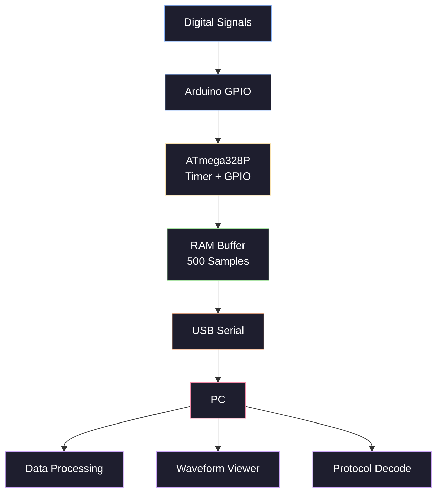
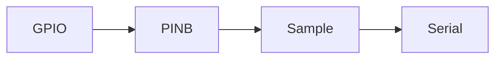
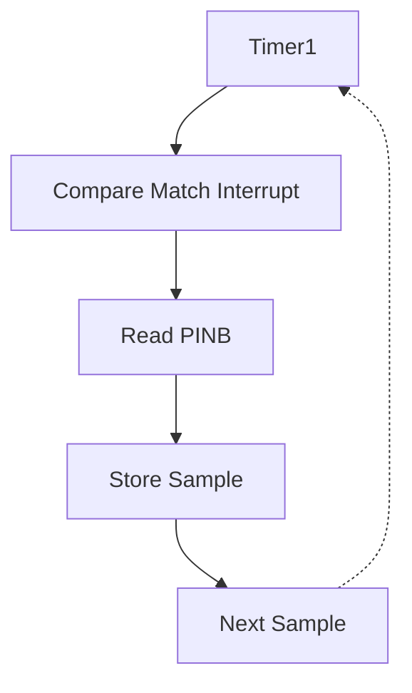
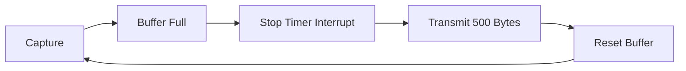
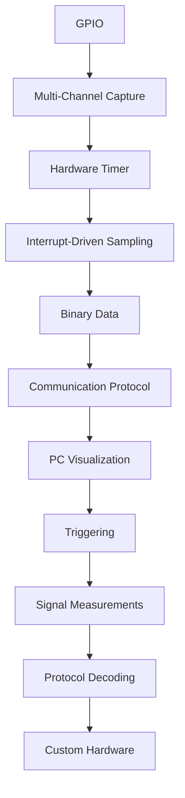

<div align="center">

# 🔬 Rontogen Digital Analyzer

### A Custom 4-Channel Digital Logic Analyzer Built from Scratch

*Understanding digital signal acquisition, one register at a time.*


</div>

---

## 📖 Table of Contents

- [Overview](#-overview)
- [System Architecture](#-system-architecture)
- [Hardware](#-hardware)
- [Development Environment](#-development-environment)
- [Development Progress](#-development-progress)
- [Firmware Architecture](#-firmware-architecture)
- [Why Direct Register Access?](#-why-direct-register-access)
- [Current Limitations](#-current-limitations)
- [Roadmap](#-roadmap)
- [Learning Objectives](#-learning-objectives)
- [Project Philosophy](#-project-philosophy)
- [Author](#-author)

---

## 🧭 Overview

A **logic analyzer** is a test instrument used to capture and analyze digital signals over time — the digital equivalent of an oscilloscope, but built for reading 1s and 0s across many channels at once.

**Rontogen Digital Analyzer** is a low-cost, custom-built alternative developed to understand *how* a logic analyzer actually works internally — from the silicon up.

> 🎯 **Project Status: Early Development — V0.4**

The project currently uses an Arduino Uno to:

| Capability | Description |
|---|---|
| 🧩 Multi-channel capture | Sample 4 digital signals simultaneously |
| ⏱️ Timer-driven sampling | Hardware Timer1 controls acquisition timing |
| 💾 On-device buffering | Captured samples stored in RAM |
| 📡 PC transmission | Captured data sent over USB serial |
| 📊 Visualization-ready | Data prepared for waveform display & protocol decoding |

The long-term goal is a complete digital logic analyzer with a **PC-based interface** and **protocol decoders** for UART, I²C, and SPI.

---

## 🏗️ System Architecture



---

## 🛠️ Hardware

### Current Hardware

| Component | Purpose |
|---|---|
| Arduino Uno | Main development board |
| ATmega328P | Core microcontroller |
| Breadboard | Prototyping platform |
| Jumper wires | Signal routing |
| LEDs | Visual signal indicators |
| Resistors | Current limiting |

> 💡 The Arduino currently generates its own test signals internally, so the capture system can be validated without an external signal generator.

### Channel Mapping

Four channels are read **simultaneously** in a single instruction via the `PINB` register — this is the key to sampling all channels at exactly the same instant.

| Channel | Arduino Pin | ATmega328P Pin |
|:---:|:---:|:---:|
| CH0 | D8 | PB0 |
| CH1 | D9 | PB1 |
| CH2 | D10 | PB2 |
| CH3 | D11 | PB3 |

### Test Signal Generator

For self-contained testing, the firmware generates its own four test signals and loops them back into the input channels:

| Signal | Output Pin | → | Input Pin |
|:---:|:---:|:---:|:---:|
| CH0 | D2 | → | D8 |
| CH1 | D3 | → | D9 |
| CH2 | D4 | → | D10 |
| CH3 | D5 | → | D11 |

Signals are generated via direct manipulation of the `PORTD` register.

---

## 💻 Development Environment

<table>
<tr>
<td valign="top" width="50%">

**Software**
- Visual Studio Code
- PlatformIO
- Arduino framework
- Git / GitHub

</td>
<td valign="top" width="50%">

**Target Hardware & Comms**
- Arduino Uno (ATmega328P)
- Baud Rate: `115200`
- Format: `8-N-1`

</td>
</tr>
</table>

---

## 📈 Development Progress

<details open>
<summary><b>V0.1 — Basic Digital Capture</b></summary>

<br>

The foundational version — establishing the core GPIO capture mechanism.

**Features**
- ✅ Configured Arduino GPIO pins
- ✅ Used ATmega328P registers directly
- ✅ Captured digital input states
- ✅ Generated a basic test signal
- ✅ Printed captured values through Serial



</details>

<details>
<summary><b>V0.2 — 4-Channel Capture</b></summary>

<br>

Expanded the system to four simultaneous digital channels.

**Features**
- ✅ Four simultaneous input channels
- ✅ Direct port manipulation
- ✅ Four independent test signals
- ✅ Simultaneous reading of D8–D11
- ✅ RAM-efficient 4-bit samples

Each captured sample is packed into a single nibble:

| Bit | 3 | 2 | 1 | 0 |
|---|:---:|:---:|:---:|:---:|
| Channel | CH3 | CH2 | CH1 | CH0 |

**Example:** `1011` → `CH3=1, CH2=0, CH1=1, CH0=1`

</details>

<details>
<summary><b>V0.3 — Timer-Based Sampling</b></summary>

<br>

Replaced software-timed polling with **hardware-timer-controlled sampling** — `Timer1` now generates precise, regular sampling events instead of the main loop guessing when to sample.

**Timer Configuration**

$$\text{Timer Clock} = \frac{16\text{ MHz}}{8} = 2\text{ MHz}$$

$$\text{Timer Period} = \frac{199+1}{2\text{ MHz}} = 100\ \mu s$$

$$\Rightarrow \text{Sampling Frequency} \approx 10\text{ kHz}$$



**Capture Buffer**

| Parameter | Value |
|---|---|
| Sample count | 500 |
| Bytes per sample | 1 |
| **Total buffer size** | **500 bytes** |

</details>

<details>
<summary><b>V0.4 — Binary Capture</b></summary>

<br>

Switched data transmission from human-readable ASCII text to **raw binary data** — a major efficiency upgrade.

**Before:** `Serial.println(sample, BIN);`
```
1011
1100
1110
```
Each sample cost multiple characters to transmit.

**Now:** `Serial.write(buffer, BUFFER_SIZE);`
```
0x0B
0x0C
0x0E
```
Raw byte values are sent directly — far more efficient, and it sets the stage for PC-side processing.

> ⚠️ **Note:** The standard Arduino Serial Monitor is *not* suitable for viewing this binary stream — it interprets incoming bytes as ASCII characters, not raw values.

</details>

---

## ⚙️ Firmware Architecture

The current firmware is organized into three core sections:

### 1️⃣ GPIO Configuration

| Pins | Direction |
|---|---|
| D8–D11 | `INPUT` |
| D2–D5 | `OUTPUT` |

Inputs are read directly from the `PINB` register.

### 2️⃣ Timer-Based Acquisition

`Timer1` runs in **CTC (Clear Timer on Compare Match)** mode. On each compare match interrupt:

```cpp
sample = PINB & 0b00001111;
```

The result is stored in the capture buffer.

### 3️⃣ Binary Data Transmission



---

## 🧠 Why Direct Register Access?

Instead of relying on abstracted Arduino functions like `digitalRead()` and `digitalWrite()`, this project accesses the ATmega328P's hardware registers directly.

```cpp
// Read all 4 input channels simultaneously, in one instruction
uint8_t channels = PINB & 0b00001111;

// Toggle a GPIO output directly
PORTD ^= 0b00000100;
```

This gives **precise control over timing** — essential for a project where accurate, simultaneous digital sampling is the entire point.

---

## 🚧 Current Limitations

This is still an early-stage prototype. Known constraints:

- 🔲 4 digital channels only
- 🔲 10 kHz sampling rate
- 🔲 500-sample capture buffer
- 🔲 Limited by Arduino Uno RAM
- 🔲 No trigger system yet
- 🔲 No PC waveform viewer yet
- 🔲 No protocol decoding yet
- 🔲 Binary packets lack sync/header info
- 🔲 Test signals are still self-generated (no external signal input yet)

---

## 🗺️ Roadmap

- [ ] **V0.5 — Binary Packet Protocol**
  Structured communication protocol between Arduino and PC:
  ```
  ┌──────────┬──────────┬──────────────┐
  │  HEADER  │  LENGTH  │ SAMPLE DATA  │
  └──────────┴──────────┴──────────────┘
  ```

- [ ] **V0.6 — PC Data Receiver**
  A Python application to open the serial port, receive binary captures, validate packets, and convert bytes into channel states.

- [ ] **V0.7 — Waveform Viewer**
  Render captured signals as digital waveforms:
  ```
  CH0 ──┐    ┌──────┐
        └────┘      └──
  CH1 ─────┐        ┌──
           └────────┘
  ```

- [ ] **V0.8 — Trigger System**
  Configurable triggering — rising edge, falling edge, high/low level, and digital pattern match — plus a pre-trigger buffer.

- [ ] **V0.9 — Signal Measurements**
  Automatic frequency, period, duty cycle, pulse width, and edge-interval measurements.

- [ ] **V1.0 — Protocol Analysis**

  | Protocol | Decode Path |
  |---|---|
  | UART | Start Bit → Data → Stop Bit |
  | I²C | START → ADDRESS → DATA → ACK → STOP |
  | SPI | SCLK / MOSI / MISO / CS |

### 🔮 Future Development

Higher sampling rates · Larger capture memory · More channels · External input protection · Adjustable sampling frequency · PC GUI · Automatic protocol detection · Custom PCB · Dedicated enclosure · Hardware trigger circuitry · FPGA-based high-speed version

---

## 🎓 Learning Objectives

<table>
<tr>
<td valign="top" width="33%">

**Digital Fundamentals**
- Digital electronics
- GPIO architecture
- MCU registers
- AVR architecture

</td>
<td valign="top" width="33%">

**Timing & Signals**
- Hardware timers
- Interrupts
- Sampling theory
- Digital signal visualization

</td>
<td valign="top" width="33%">

**Systems & Protocols**
- Embedded C/C++
- Serial communication
- Binary data protocols
- UART / I²C / SPI
- PCB development

</td>
</tr>
</table>

---

## 🧩 Project Philosophy

Rontogen Digital Analyzer is built **incrementally**, not as a single finished design — each version introduces exactly one new engineering concept.



The objective isn't just to build a working logic analyzer — it's to **understand how every component of a digital test instrument works together**, from the register level up.

---

## 👤 Author

**Padma Charan S S**
Electrical and Electronics Engineering
PSG College of Technology

<div align="center">

*Built to learn how digital test instruments really work — one version at a time.*

</div>